<div align="center">

# NeuraScan AI

### Intelligent behavioural screening for neurological risk analysis

**A few short tests on your phone become eighteen behavioural measurements — compared against *your own* usual, not against everybody else's.**

[](https://flutter.dev)
[](https://dart.dev)
[](engine_lab/)
[](#9--how-it-is-tested)
[](#7--privacy-by-construction-not-by-policy)
[](LICENSE)

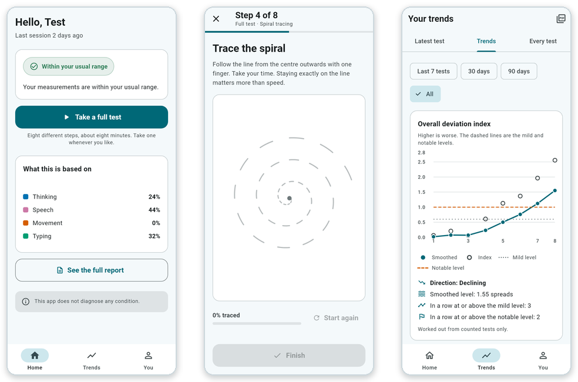

</div>

> [!IMPORTANT]
> **NeuraScan AI does not diagnose any condition.** It is a screening and awareness tool. It is
> not a medical device, it has not been clinically validated, and it is not a substitute for a
> doctor. Every quantitative figure in the project report comes from a simulated cohort, and every
> population reference range that ships with the app is a placeholder.

---

## Contents

| | |
| --- | --- |
| [What is NeuraScan AI?](#what-is-neurascan-ai) | What the thing actually is |
| [The problem](#the-problem) | Why the middle of the picture is missing |
| [How NeuraScan AI helps](#how-neurascan-ai-helps) | Test → eighteen numbers → one honest status |
| [What it has that others don't](#what-neurascan-ai-has-that-similar-apps-dont) | Five things, and why they are hard |
| [Features](#features) | The tour, with screenshots and animations |
| [Build and run](#build-and-run) | Getting it onto a device |
| [What still needs work](#what-still-needs-work) | The honest list |
| [Conclusion](#conclusion) · [Licence](#licence) | |

---

## What is NeuraScan AI?

NeuraScan AI is an **Android app, built in Flutter**, that turns a short self-administered session
into a measurement you can track over months.

You take a **full test** — eight different steps, about eight minutes, taken whenever you like.
Word memory, reaction time, speech, spiral tracing, typing rhythm, trail-making, finger tapping and
verbal fluency. From those eight steps the app extracts **eighteen behavioural measurements** across
four areas: thinking, speech, movement and typing.

Then it does the thing that makes it different: it compares those eighteen numbers with **your own
baseline** — the median and spread of your own earlier tests — rather than with a population norm.
A change is reported only when it is large for *you*, and only once it has **persisted across three
tests in a row**.

<div align="center">
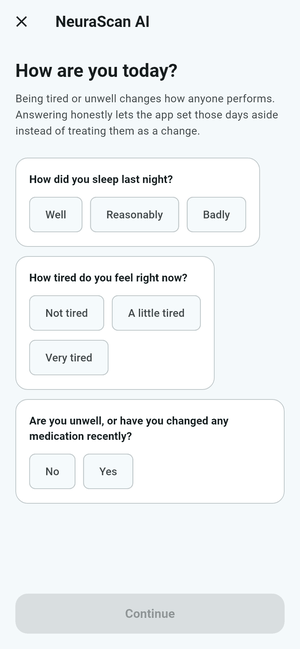
</div>

| | |
| --- | --- |
| **Eight steps** in a full test | about eight minutes |
| **Eighteen measurements** | thinking × 9, speech × 2, movement × 5, typing × 2 |
| **Your baseline** | one practice test plus three short tests, three minutes each |
| **A reported change** | needs three consecutive tests above the threshold |
| **Raw recordings kept** | none. Audio and touch traces never reach the disk |
| **Works offline** | yes. No account and no connection are required |
| **Languages** | English and Tamil |

<sub>Submitted for Mobile Application Development (CS4504), Chennai Institute of Technology. The
full report and poster are in [`documentation/`](documentation/).</sub>

---

## The problem

Neurological change is **gradual, and it is hardest to see from the inside**. Days vary for ordinary
reasons — a bad night's sleep, stress, a cold — so a slow drift hides comfortably inside that noise.
By the time someone close enough to notice says something out loud, the first measurement anyone has
ever taken is the one at the appointment. There is nothing to compare it to.

<div align="center">
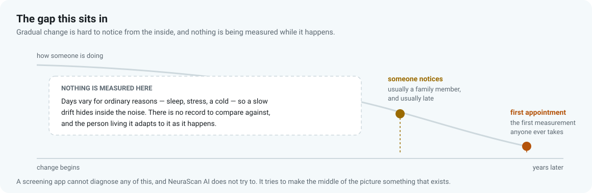
</div>

There is a second problem, and it is the reason most consumer "brain health" apps cannot help with
the first. They tell you how you compare with **other people your age**. But the normal range for a
population is enormously wide. Someone can lose a great deal of their own ability and still sit
comfortably inside it — and someone who has always been at the lower end gets told, every single
time, that something is wrong when nothing has changed at all.

**Comparing a person to a population answers the wrong question.** The question that matters is not
*are you unusual?* but *have you changed?*

---

## How NeuraScan AI helps

It makes the middle of that picture exist: a record of how *you* perform, taken often enough and
measured carefully enough that a drift has somewhere to show up.

<div align="center">
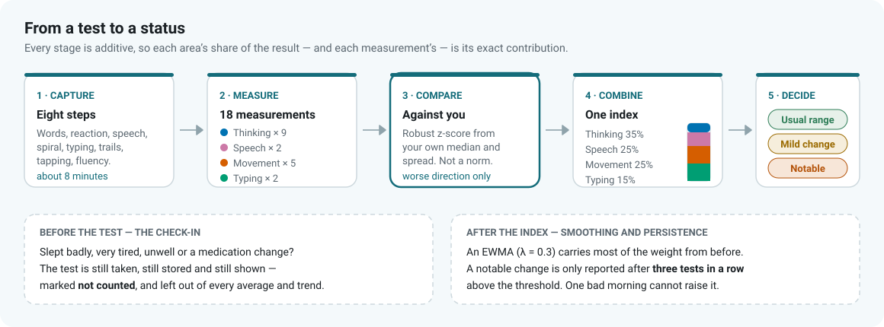
</div>

**Nothing is scored until the app knows what your usual looks like.** The first test is practice and
is thrown away — everyone improves simply by getting used to the tasks, and counting that improvement
as a baseline would poison every comparison that followed.

<div align="center">
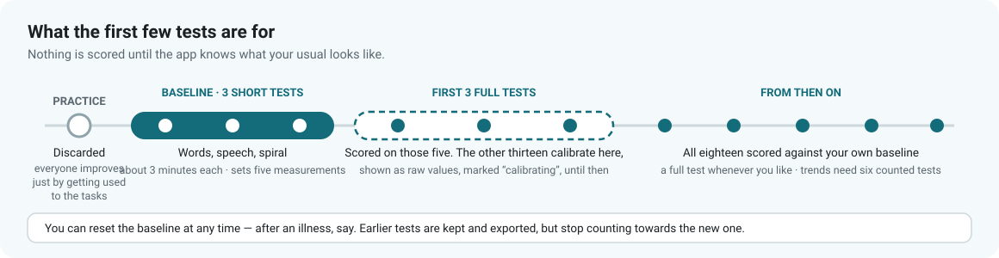
</div>

The home screen says which of those three stages you are in, and nothing more than it can defend:

<table>
<tr>
<td width="33%" align="center">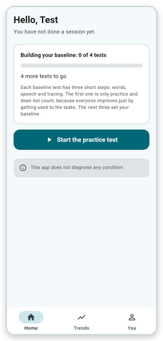</td>
<td width="33%" align="center">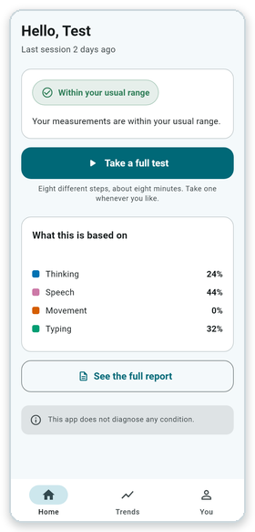</td>
<td width="33%" align="center">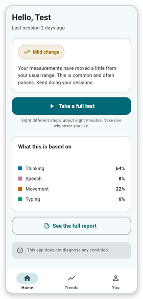</td>
</tr>
<tr>
<td align="center"><b>Building your baseline</b><br><sub>Nothing is scored yet, and it says so</sub></td>
<td align="center"><b>Within your usual range</b><br><sub>With the exact share each area contributed</sub></td>
<td align="center"><b>Mild change</b><br><sub>Worth noticing, not worth alarming anyone</sub></td>
</tr>
</table>

Three design decisions do most of the work:

- **Robust statistics, not means.** The baseline is a median and a MAD, so one bad test cannot drag
  the centre. The spread is never allowed to fall below half of a measurement's typical day-to-day
  variation, which stops an unusually consistent run of tests from making every later test look
  dramatic.
- **Worsening only, and additive.** Only changes in the worse direction count, and the index is a
  plain weighted sum (thinking 35%, speech 25%, movement 25%, typing 15%, re-normalised over
  whatever was measurable). Because it is additive, each area's share of the result — and each
  measurement's — is its *exact* contribution, not an approximation of one.
- **Patience.** An EWMA (λ = 0.3) smooths the index, and a notable change is reported only after
  three consecutive tests above the threshold. One bad morning cannot raise an alert.

---

## What NeuraScan AI has that similar apps don't

### 1. It compares you with yourself

<div align="center">
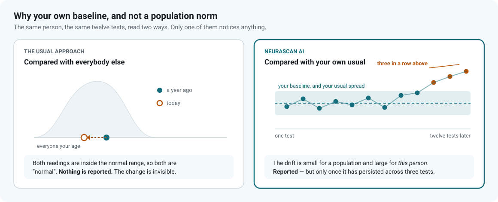
</div>

This is the whole thesis. A population norm is a question about *other people*; a personal baseline
is a question about *you*. Everything else in the app exists to make that comparison trustworthy.

### 2. It knows when not to count a test

Before every test, a three-question check-in: how did you sleep, how tired are you, has anything
changed with illness or medication. A test taken on a bad day is **still taken, still stored and
still shown** — marked *not counted*, drawn as a hollow marker, and left out of every average, best,
worst, slope and run. It is never dropped quietly, and the user is warned *before* the test that it
will not count, while they can still choose to come back later.

### 3. It refuses to confuse three different comparisons

Most apps mix "worse than last time", "worse than your usual" and "below average" into one number.
NeuraScan AI keeps them apart, visibly, for every measurement — and only the first of the three is
ever allowed to change your status.

### 4. It will not pretend to a number it does not have

Every population reference range that ships is a placeholder, and the app says so in plain words:
*"Reference range not yet validated."* No range, source or age band has been invented to fill a gap.
Thirteen measurements the baseline tests never take are shown as raw values, labelled
**calibrating**, until the first three full tests have set their baseline.

### 5. The engine was written twice

The screening engine was built and tested in **Python** first ([`engine_lab/`](engine_lab/)), then
mirrored module for module in Dart, with the Dart tests mirroring the Python suite case for case.
157 Python tests and 862 Dart tests have to agree before anything ships.

<br>

| | Typical brain-training app | Symptom checker | **NeuraScan AI** |
| --- | :---: | :---: | :---: |
| Compared against | a population norm | a population norm | **your own baseline** |
| Handles a bad day | no | no | **check-in sets it aside** |
| Waits before reporting | no | no | **three tests in a row** |
| Says where a result came from | rarely | no | **exact contribution per measurement** |
| Raw audio / touch stored | commonly | n/a | **never written to disk** |
| Cloud backup | typically on | typically on | **off by default** |
| Admits what it does not know | rarely | rarely | **placeholders are labelled as such** |

<sub>A comparison with the usual shape of those two categories, not with any particular product.</sub>

---

## Features

### 1 · A full test: eight steps, about eight minutes

Every step is designed for someone over 45 holding a phone at arm's length — large tap targets,
no fine colour distinctions, and every text style survives the system font scale at 200%.

<div align="center">
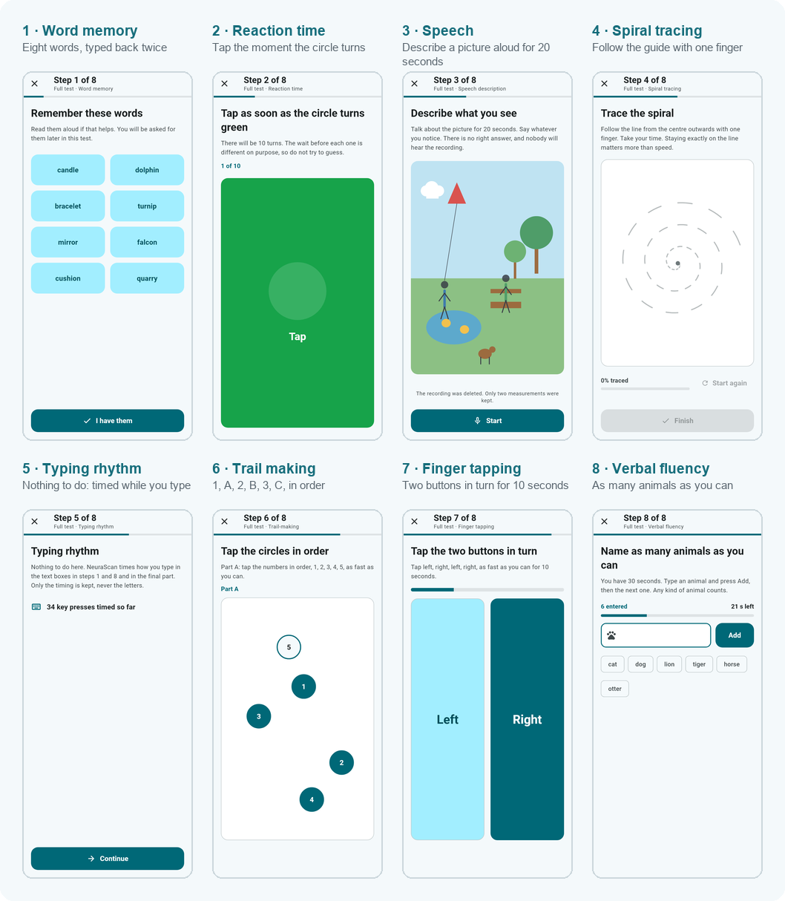
</div>

| # | Step | What you do | What it measures | Area |
| --- | --- | --- | --- | --- |
| 1 | Word memory | Learn eight words; type them back straight away, and again at the end | Immediate recall, delayed recall | Thinking |
| 2 | Reaction time | Tap the moment the circle changes, ten times, after a random 1–4 s wait | Median reaction time, variability | Thinking |
| 3 | Speech | Describe a picture aloud for 20 seconds | Speaking rate, pause ratio | Speech |
| 4 | Spiral tracing | Trace a guide spiral with one finger | Tracing error, tremor index (4–12 Hz) | Movement |
| 5 | Typing rhythm | Nothing — you are timed while typing in steps 1 and 8 | Inter-key interval and its variability | Typing |
| 6 | Trail-making | Tap 1, A, 2, B, 3, C … in order | Completion time, errors, switch cost | Thinking |
| 7 | Finger tapping | Alternate two buttons for 10 seconds | Tap rate, interval variability, fatigue decay | Movement |
| 8 | Verbal fluency | Type as many animals as you can in 30 seconds | Valid word count, late/early ratio | Thinking |

<table>
<tr>
<td width="33%" align="center">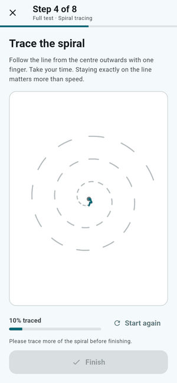</td>
<td width="33%" align="center">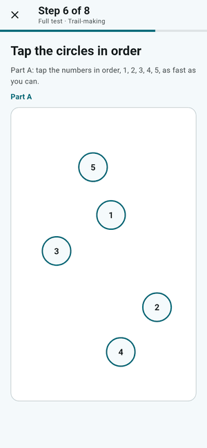</td>
<td width="33%" align="center">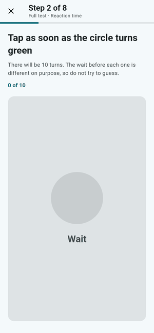</td>
</tr>
<tr>
<td align="center"><b>Spiral tracing</b><br><sub>Tracing error and a 4–12 Hz tremor index, from one gesture</sub></td>
<td align="center"><b>Trail-making</b><br><sub>Completion time, errors, and the cost of switching between sequences</sub></td>
<td align="center"><b>Reaction time</b><br><sub>A random foreperiod, so the wait cannot be anticipated</sub></td>
</tr>
</table>

A step that cannot be scored — a silent room, a slipped finger, too many early taps — is simply
**asked for again**. One bad step never costs a whole test.

### 2 · A check-in that decides whether the test counts

<table>
<tr>
<td width="30%">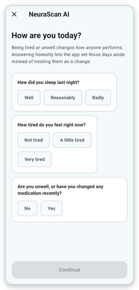</td>
<td>

Three questions before every test, and the answer changes what happens to it.

A test taken after a bad night is **saved, scored and shown** — and then held out of every average
and trend, marked *not counted*, with the reason attached. The app tells you this **before** you
start, not afterwards.

This is the difference between an app that is honest about noise and an app that quietly lets noise
become a trend.

</td>
</tr>
</table>

### 3 · A result the moment you finish

<table>
<tr>
<td>

No waiting, no upload. The status, what it was based on — area by area, as exact contributions —
the measurements that moved the index most, and a card for each of the eight steps.

The status colours deliberately avoid the red-alert register. A notable change means *"this has
persisted and is worth discussing with a doctor"*, not *"something is wrong with you"*.

The words you recalled are shown here and only here: *you remembered six of the eight words, and
these were the ones you missed.* That is far more meaningful than a fraction, and it is the one part
of a test you can check for yourself.

</td>
<td width="26%">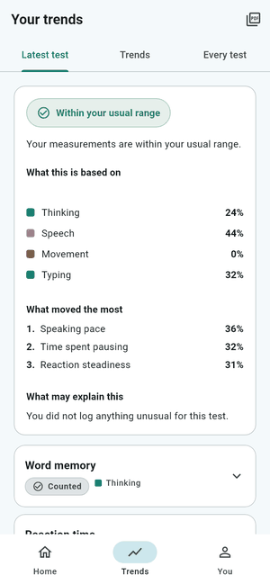</td>
<td width="26%">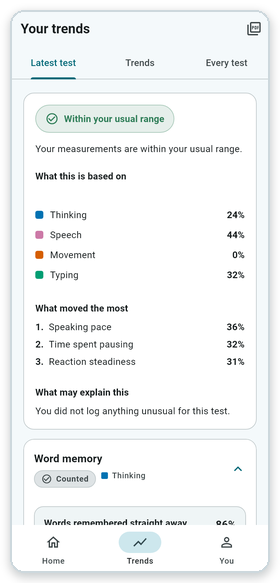</td>
</tr>
</table>

### 4 · Three comparisons, kept apart

<table>
<tr>
<td width="34%">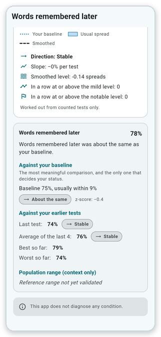</td>
<td>

For every one of the eighteen measurements:

1. **Against your own baseline** — the frozen median and spread, a z-score oriented so positive is
   always worse, and a plain word: better, about the same, or worse. **This is the only comparison
   that can change your status.**
2. **Against your earlier tests** — last test, the average of the last four, best and worst so far.
3. **Against a population range** — context only, never a verdict. Shown only when the entry is
   validated, which today means it is shown for nothing at all.

Keeping them apart is a design decision, not an oversight. Mixing them is exactly how an app ends up
telling a perfectly healthy person that they are declining.

</td>
</tr>
</table>

### 5 · Trends that wait for evidence

<table>
<tr>
<td>

Each measurement and area gets a chart: your baseline line, your usual-spread band, the smoothed
line, and hollow markers for the tests that were set aside. A Theil-Sen slope gives the direction —
but only after **six valid tests**. Before that the app says *"Not enough data yet (n of 6)"* rather
than drawing a trend through three points.

The example on the right is the case the whole app is built for: an index climbing steadily, three
tests in a row above the mild level, two above the notable one — and a status that is still saying
*mild* because the persistence rule has not been satisfied yet.

</td>
<td width="34%">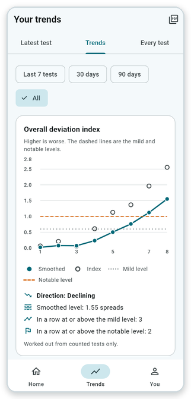</td>
</tr>
</table>

<table>
<tr>
<td width="50%" align="center">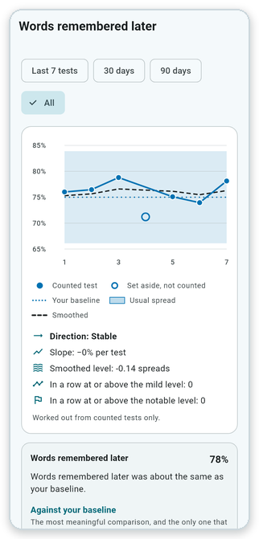<br><sub>One measurement over time, against your own band</sub></td>
<td width="50%" align="center">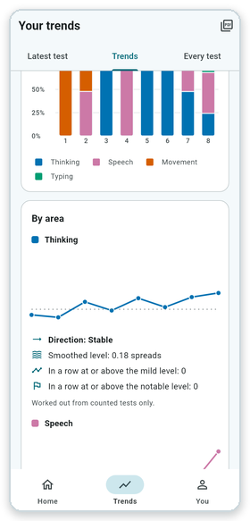<br><sub>What each test&#8217;s change was made of, by area</sub></td>
</tr>
</table>

### 6 · A report you could actually hand to a doctor

<div align="center">
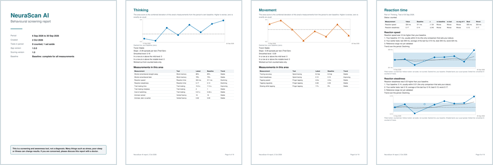
</div>

A paged A4 PDF, built **entirely offline**: a cover, a summary, a page for each area, a section for
each of the eight tests, the log of every test taken, and a methods-and-limitations page — with the
disclaimer on the cover, on the summary and on the last page. Plus CSV and JSON of the derived data
for anyone who wants to do their own analysis.

You choose the period and the sections, label it, preview it, and **confirm before every single
export**: once a file leaves the app, the app's privacy settings no longer apply to it, and the user
is told exactly that each time.

<table>
<tr>
<td width="50%" align="center">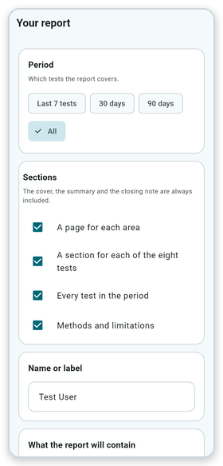<br><sub>Choose the period and the sections</sub></td>
<td width="50%" align="center">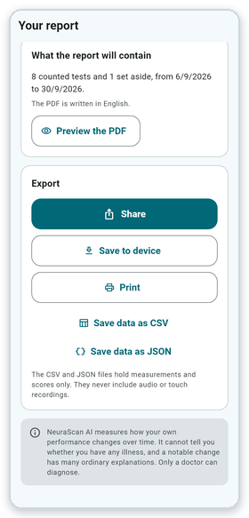<br><sub>See what it will contain, then export</sub></td>
</tr>
</table>

### 7 · Privacy by construction, not by policy

<div align="center">
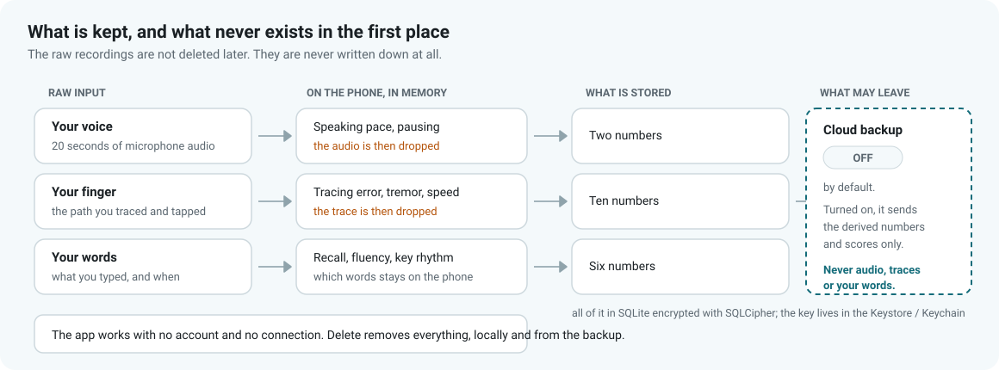
</div>

The raw recordings are not deleted afterwards — **they are never written down in the first place.**
Audio is captured into memory, analysed on the device, and dropped. Touch traces are reduced to a
few numbers and dropped. Which words you recalled is scored locally and never leaves the phone.

What remains lives in **SQLite encrypted with SQLCipher**, with the key in the Android Keystore or
iOS Keychain. Cloud backup is **off by default**; turned on, it uploads only the derived measurements
and scores. There is a single button that deletes everything, locally and from the backup.

<table>
<tr>
<td width="50%" align="center">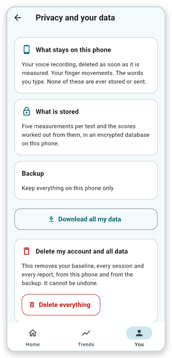<br><sub>The same explanation, inside the app</sub></td>
<td width="50%" align="center">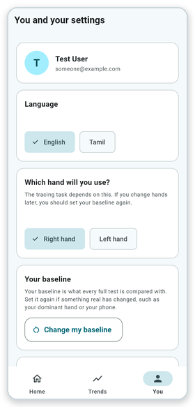<br><sub>Baseline, language, hand and reminders</sub></td>
</tr>
</table>

### 8 · Built for the people who would use it

<table>
<tr>
<td width="50%" align="center">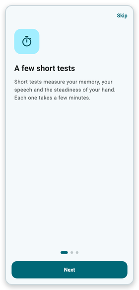<br><sub>The idea is explained before anything is asked for</sub></td>
<td width="50%" align="center">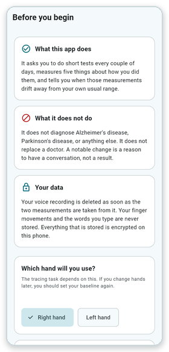<br><sub>What it does, what it does <i>not</i> do, and what happens to your data</sub></td>
</tr>
</table>

Material 3 throughout, in **English and Tamil**. A 48 dp minimum tap target everywhere, including the
hand-built task screens. Status is never signalled by colour alone — every status carries an icon and
a label with it. A reminder every couple of days, which is the entire retention mechanism, because an
app like this is worthless if it is opened once.

The onboarding explains the personal-baseline idea *before* asking for anything, and the consent gate
is enforced by the router rather than per screen — so a screen added tomorrow is behind it the moment
it exists, instead of only if its author remembered.

### 9 · How it is tested

<table>
<tr>
<td>

The app runs **end to end in a widget test** — in-memory database, fake auth, recording sync backend,
no emulator and no cloud project. The full eight-step test is played through the real screens, the
real extractors and the real engine, and the stored result is asserted on.

That same harness is what produces every screenshot in this README. Nothing here is a mock-up: each
image was rendered by driving the actual app, and the whole set regenerates in about a minute
(see [`tool/screenshots/`](tool/screenshots/)).

</td>
<td width="30%">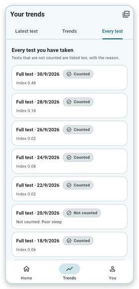</td>
</tr>
</table>

```bash
flutter analyze && flutter test        # 862 tests
cd engine_lab && python -m pytest -q   # 157 tests, the reference engine
```

---

## Build and run

Requires **Flutter 3.47+** (Dart 3.13+), **JDK 17** and the Android SDK.

```bash
flutter pub get
flutter gen-l10n                 # localisations (English, Tamil)
dart run build_runner build      # the Drift database code
flutter run
```

<details>
<summary><b>Repository layout</b></summary>

```
lib/
  engine/           the screening engine, feature extractors and comparison
                    (pure Dart — no Flutter dependency, so it is testable alone)
  data/             encrypted Drift database, repository, auth and sync interfaces
  features/         onboarding, auth, dashboard, the session and its steps,
                    trends, report, profile
  features/report/  results, trends and report: calculators, charts, PDF, CSV/JSON
  services/         notifications, audio capture
  app/              theme, router, providers, localisation
engine_lab/         the Python reference implementation of the engine, and its tests
test/               Dart tests: engine, data layer, widgets, and whole test flows
test/screenshots/   drives the real app to render this README's images
tool/screenshots/   turns those frames into the committed PNGs and GIFs
docs/               module documentation and the images used here
documentation/      the submitted project report and poster
```

The Dart engine mirrors the Python one module for module, and the Dart tests mirror the Python suite
case for case. The better/worse comparison is display logic on top of the engine, and exists only in
Dart.

</details>

<details>
<summary><b>Regenerating the screenshots</b></summary>

```bash
flutter test test/screenshots --dart-define=capture=true
python tool/screenshots/compose.py
```

Without the define, the capture cases skip themselves, so an ordinary test run and CI never touch
them. See [`tool/screenshots/README.md`](tool/screenshots/README.md).

</details>

---

## What still needs work

This is version 1.0, and the list below is the honest state of it. None of these are hidden in the
app either — the ones a user would care about are stated on screen.

| | What is wrong | What it would take |
| --- | --- | --- |
| 🔴 | **No clinical validation.** Thresholds were calibrated on synthetic data. The project report's figures describe an earlier five-measurement design and have not been re-run for the eighteen-measurement engine. | A pilot study. Nothing else substitutes for it, and until then this is an awareness tool and nothing more. |
| 🔴 | **Every population reference range is a placeholder.** The app says so, but it means the third comparison currently shows nothing. | Sourced, age-banded ranges with citations. [`docs/REPORT_MODULE.md`](docs/REPORT_MODULE.md) documents how to add a real one. |
| 🟠 | **Nine of the eighteen measurements use provisional day-to-day spreads** (`provisional: true` in [`lib/engine/features.dart`](lib/engine/features.dart)), and the minimum change for a trend to be called a direction (`kTrendMinChangeSds`) is untuned. | Pilot data. Both are placeholders chosen to be plausible, not measured. |
| 🟠 | **Cloud sync and Firebase are not wired to a project.** Authentication is local; sync is a disabled backend. | Both sit behind interfaces, so a Firebase implementation drops in without touching a single screen. |
| 🟠 | **The first of the three calibrating full tests still carries a practice effect.** The baseline tests get a discarded practice run; the extended measurements do not. | A familiarisation allowance (`kExtensionFamiliarisation` in [`lib/engine/constants.dart`](lib/engine/constants.dart)) or a fourth calibrating test. |
| 🟡 | **Android is the only platform that has been run on a device.** The iOS project is generated but unbuilt. | A Mac, and the iOS permission strings. |
| 🟡 | **The PDF is in English whatever the app's language** — its built-in fonts carry no Tamil glyphs. | Bundling a Tamil-capable font in the PDF build. |
| 🟡 | **Verbal fluency is listed as both cognitive and speech in the brief**; both of its measurements are scored as cognitive. | A decision, and possibly a split weight. |

Beyond fixing those: longitudinal validation against a clinical instrument, a larger word pool to
reduce learning effects over many months, and an accessibility pass with the users this is actually
aimed at rather than with the simulator.

---

## Conclusion

NeuraScan AI is a complete, working v1.0 of an idea that is simple to state and surprisingly hard to
build: **measure a person against themselves, often, and be honest about the noise.**

The parts that were hard were not the UI. They were deciding that a practice test must be thrown
away, that a tired day must be stored and *then* excluded, that only changes in the worse direction
should count, that a result should wait for three tests before it says anything alarming, and that an
unvalidated reference range should say so rather than quietly look authoritative. Each of those makes
the app report *less*, and each of them is what makes the little it does report worth reading.

What it is not is a diagnosis, and the app says that on the dashboard, on every result, on the cover
of the report, in its summary and on its last page. It cannot tell you whether you have a condition.
It can tell you that something about how you are doing has moved, for you specifically, and has kept
moving — which is a reason to talk to someone who *can*.

---

## Licence

Released under the [MIT Licence](LICENSE).

```
Copyright (c) 2026 Madhav M S and M Kiruthick Kannaa
```

You may use, copy, modify, merge, publish, distribute, sublicense and sell copies of this software,
provided the copyright notice and the permission notice are included. The software is provided
"as is", without warranty of any kind — and that disclaimer applies to clinical or diagnostic use in
particular. See [`LICENSE`](LICENSE) for the full text.

<div align="center">
<br>
<sub>Built with Flutter · engine written twice, in Python and Dart · every screenshot above is the real app</sub>
</div>
